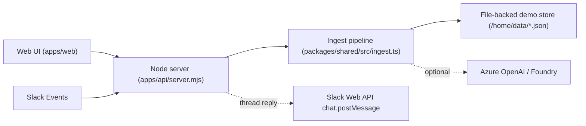

# Trade Shelf Agent

Drop messy operational conversations into an inbox.  
AI classifies trade requests, resolves relationships (INV / SI / SHP / PL), drafts replies, and routes risky actions to an approval center.

- Demo video: <!-- TODO: add demo video link -->
- Zenn article: <!-- TODO: add Zenn article link -->
- Hackathon: Microsoft Agent Hackathon 2026 ([Zenn](https://zenn.dev/hackathons/microsoft-agent-hackathon-2026))

## Problem / Why

貿易・物流の現場では、番号と書類が複雑に絡みます。

- Shipment / Invoice / SI / Packing List / B/L が分散し、関係が曖昧になりやすい
- Slack / Teams / Email の「短い確認メッセージ」から、業務意図と対象案件を特定する必要がある
- 外部送信や状態変更は、現場判断が必要なため **Human-in-the-loop** が必須

Trade Shelf Agent は、この「曖昧な問い合わせ → 対象特定 → 状態判断 → 次アクション」を processor 群として処理し、判断と履歴を残します。

## Demo Scenarios

### Scenario 1: 営業問い合わせ → clarification → PL missing → supplier followup approval

1. 営業が Slack / Web から「PLまだ？」のような問い合わせを投げる
2. **Clarification Processor** が不足情報（SHP / SI / INV など）を質問として返す（thread reply / Webチャット）
3. 追加情報の返信が来ると、元問い合わせに紐付けて ingest を再実行
4. **Relationship Resolver** が INV/SI/SHP を TradeCase に寄せ、PL status を解決する
5. PL未着なら、仕入先督促メール案を **Draft Writer** が生成し、**Approval Center** に載せる

<!-- screenshot: docs/images/sales-chat.png -->
<!-- screenshot: docs/images/approval-center-pl-followup.png -->

### Scenario 2: 状態変更 → approval → shelf state transition

1. 「出荷済み」「通関に進んだ」など、状態更新を含む入力を ingest
2. **状態遷移候補** を検出し、リスク付きで Approval Center に提示
3. 承認すると Shelf の状態（棚）が更新され、Activity に履歴が積まれる

<!-- screenshot: docs/images/state-transition-approval.png -->
<!-- screenshot: docs/images/shelf-after-transition.png -->

## Architecture (as implemented)

Slack と Web UI は入口が違うだけで、どちらも同じ ingest pipeline（`packages/shared/src/ingest.ts`）を通ります。  
現状実装の詳細図は `docs/current-architecture.md` を参照してください。



## Processor / Agent Design

このデモは「人格AI」ではなく、業務処理単位の processor として分割しています（詳細: `docs/agent-processors.md`）。

- Classification: 入力を intent + 抽出エンティティへ整形（LLM または rule/mock）
- Clarification: 情報不足なら確認質問を出し、返信で ingest を再接続
- Relationship Resolver: INV/SI/SHP/PL の関係を TradeCase に解決して寄せる
- Operational Responder: PL未着など、デモで重要なケースに絞って返信/承認ブリッジを行う
- Human Approval: 外部送信・状態変更は必ず承認を通す

## Tech Stack (current)

- Node.js (`apps/api/server.mjs`): API + SPA static hosting
- Web UI (`apps/web/app.js`): framework-less SPA (demo UI)
- Shared domain + pipeline (`packages/shared/src/*`): ingest / resolver / types
- Azure OpenAI / Foundry: LLM classification（利用可能な場合）
- Slack API: Events 受信 + thread reply（トークンがある場合のみ送信）

## Current Status

- demo-oriented implementation（Hackathon向けに軽量化）
- 永続化は file-backed（`/home/data/*.json`）で、DB は未導入
- TradeCase は mock + demo-created（承認で追加されるケースもある）
- Operational Responder は **PL未着検出 → 仕入先督促 draft → 承認ブリッジ** を中心に実装
- LLM が無い場合も `mock / rule` fallback で ingest は動作

## Run locally

```bash
npm install
node apps/api/server.mjs
```

ブラウザで `http://localhost:3000` を開きます。

## Future Work (high level)

- 書類間の整合性チェック（SI / INV / PL / BL…）
- インシデント検知の拡張（差異・遅延・分納など）
- 本番DB（例: Cosmos DB）への移行と、audit/decision log の強化
- 外部連携（Outlook / ERP / Shopify など）と workflow 拡張
