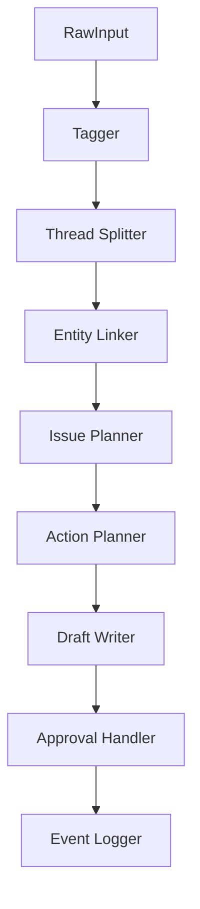

# Agent Processors

## 基本思想

Trade Shelf Agent は、「なんでも答える貿易AI」を作るものではない。

代わりに、小さな Processor（処理器）を連結した構造を採用する。

各 Processor は:

- 明確な責務
- 構造化された入力 / 出力
- failure handling
- 次処理への明示的トリガー

を持つ。

目的は:

- AI挙動を観測可能にする
- 処理状態を追跡可能にする
- 人間が途中介入できるようにする
- JSON出力を小さく保つ
- 「分類」と「文章生成」を分離する

ことである。

AIの主用途は:

- 分類
- 分解
- 抽出
- 紐付け
- 行動計画
- 下書き生成

であり、「自由意思を持つ業務AI」ではない。

---

# Processor Pipeline



各 Processor は、処理結果を Orchestrator / Router に返す。

Orchestrator は:

- 処理成功判定
- 次に動かす Processor
- Human Review が必要か
- 処理停止すべきか

を判断する。

Processor 同士は直接呼び出さない。

---

# Processor Definitions

---

## Processor I/O shape（最小）

各 Processor は「最小の I/O shape（入力/出力）」を持つ。ここで示す shape は、Orchestrator が Processor を差し替え可能に保つための契約である。

### RawInput（最小）

- `id`
- `source`
- `rawText`
- `receivedAt`
- `senderName`
- `channel`

### Tagger / Thread Splitter

input:

- `RawInput`

output:

- `OperationalThread[]`

### Entity Linker

input:

- `OperationalThread[]`

output:

- `EntityLink[]`

### Issue Planner

input:

- `RawInput`
- `OperationalThread[]`
- `EntityLink[]`

output:

- `IssueMutation[]`

### Action Planner

input:

- `RawInput`
- `OperationalThread[]`
- `EntityLink[]`
- `IssueMutation[]`

output:

- `ActionPlan[]`

### Draft Writer

input:

- `RawInput`
- `OperationalThread[]`
- `EntityLink[]`
- `IssueMutation[]`
- `ActionPlan[]`

output:

- `DraftDocument[]`

### Approval Handler

input:

- `ActionPlan[]`
- `DraftDocument[]`

output:

- `ActionPlan[]`（status updated）
- `DraftDocument[]`（status updated）

### Event Logger

input:

- `RawInput`
- `OperationalThread[]`
- `EntityLink[]`
- `IssueMutation[]`
- `ActionPlan[]`

output:

- `ActivityEvent[]`

---

# State Machines（最小）

## ActionPlan

- `planned`
  - → `pending_approval`（承認が必要な場合）
  - → `skipped`（human_review_only などでスキップ扱いにする場合）
- `pending_approval`
  - → `approved`
  - → `held`
  - → `edited`
- `approved`
  - → `mock_sent`

## Draft

- `drafted`
  - → `pending_approval`（必要なら）
- `pending_approval`
  - → `approved`
  - → `held`
  - → `edited`
- `approved`
  - → `mock_sent`

## 1. Tagger

### 役割

受信した入力が「何の話か」を分類する。

### Input

- RawInput

### Output

- tags
- intent candidates
- confidence

### 例

- missing_document
- si_check
- quantity_mismatch
- eta_change
- air_change_check
- supplier_reply
- unknown

### やらないこと

- Issue作成
- メール作成
- 承認
- 外部送信

### Failure

- failed_processing event
- manual_review_required tag

---

## 2. Thread Splitter

### 役割

1つの RawInput を複数の業務スレッドへ分解する。

### 例

入力:

```text
PLまだ？あとSI-224も確認して
```

出力:

- THR-1: PL確認
- THR-2: SI-224確認

### Output

- OperationalThread[]

### やらないこと

- 最終行動決定
- draft作成
- approval判定

### Failure

- split_failed
- ambiguous_threading

---

## 3. Entity Linker

### 役割

各 OperationalThread が、どの Entity に関係するか紐付ける。

### Entity Types

- SI
- Shipment
- Document
- Supplier
- Issue

### Output

- EntityLink[]

### 例

```json
{
  "entityType": "SI",
  "entityId": "SI-2026-224"
}
```

### やらないこと

- draft作成
- approval
- action決定

### Failure

- entity_not_found
- ambiguous_entity_match

---

## 4. Issue Planner

### 役割

各 thread が:

- 既存Issue更新か
- 新規Issue候補作成か

を決定する。

### Output

- IssueMutation
- IssueCandidate
- issueId
- candidateId
- status

### 例

- pending_approval
- review_required
- resolved_candidate

### やらないこと

- メール生成
- Teams返信生成

### Failure

- issue_match_failed
- duplicate_issue_candidate

---

## 5. Action Planner

### 役割

「次に何をすべきか」を決める。

### Action Tags

- human_review_only
- email_required
- teams_reply_required
- supplier_confirmation_required
- forwarder_confirmation_required
- no_action

### Output

- action tags
- next action candidates

### やらないこと

- draft生成
- 外部送信

### Failure

- no_clear_action
- conflicting_actions

---

## 6. Draft Writer

### 役割

必要時のみ、外部送信用の文案を生成する。

### Trigger

Action Planner が:

- email_required
- teams_reply_required

などを付与した場合のみ動作。

### Output

- Email draft
- Teams reply draft

### やらないこと

- 承認
- 自動送信

### Failure

- draft_generation_failed
- unsafe_draft_detected

---

## 7. Approval Handler

### 役割

AI提案に対し、人間が:

- approve
- edit
- hold
- reject

を行う。

### Human Actions

- Approve
- Edit
- Hold
- Reject

### Output

- approval status
- approval event
- edited draft
- execution permission

### やらないこと

- 無承認送信

### Failure

- approval_timeout
- rejected_by_human

---

## 8. Event Logger

### 役割

全処理を Activity Feed に記録する。

### Event Examples

- raw_input_received
- classified
- entity_linked
- issue_updated
- approval_required
- email_draft_created
- approved
- failed_processing

### 目的

システム状態を:

- traceable
- auditable
- debuggable

にする。

---

# Orchestrator / Router

## 役割

Processor 実行フローを管理する。

Processor 同士は直接次を呼ばない。

代わりに:

```text
Processor
↓
構造化結果を返す
↓
Orchestrator が状態確認
↓
次Processorを決定
```

という流れを取る。

### 例

```text
Action Planner
↓
email_required tag
↓
Orchestrator が Draft Writer を起動
```

もし:

```text
failed_processing
```

なら:

```text
Human Review queue
```

へルーティングする。

---

# Activity Feed の思想

Activity Feed は単なるログではない。

「処理状態の可視化」である。

Activity Feed では:

- 今どの Processor が処理したか
- どこまで進んだか
- どこで止まったか
- 人間確認が必要か

を把握できる必要がある。

---

# 設計思想

Trade Shelf Agent は:

- chatbot
- 自律AI秘書
- 曖昧な貿易AI

を作るものではない。

作っているのは:

- operational decomposition system
- event-driven workflow layer
- human-in-the-loop operational intelligence system

である。

AIの主役割は:

- classify
- split
- link
- plan
- draft

であり、自律実行ではない。
