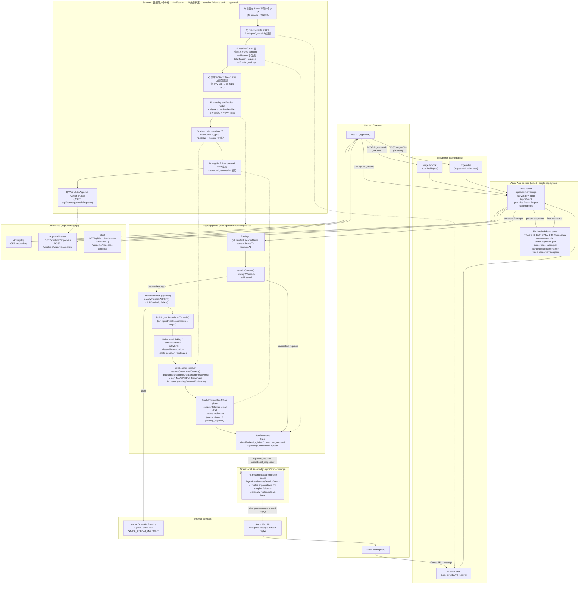

# Current Architecture (as implemented)

この図は「理想構成」ではなく、`README.md` / `apps/api/server.mjs` / `packages/shared/src/ingest.ts` / `packages/shared/src/relationshipResolver.ts` の **現状実装** をベースにしています。

