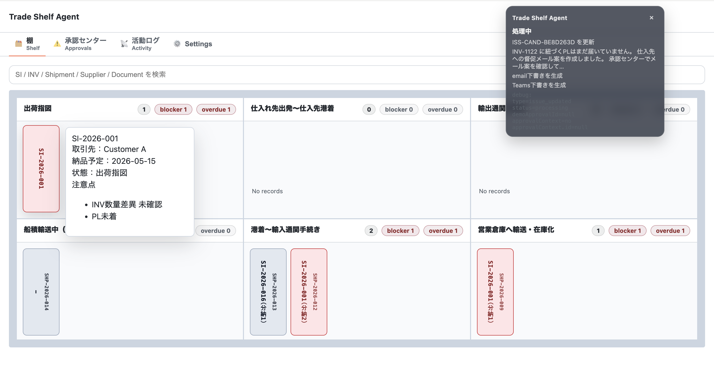
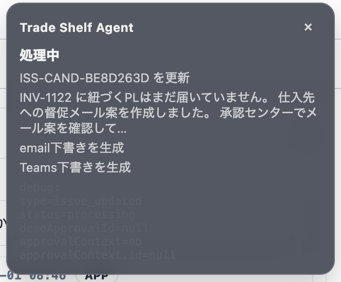
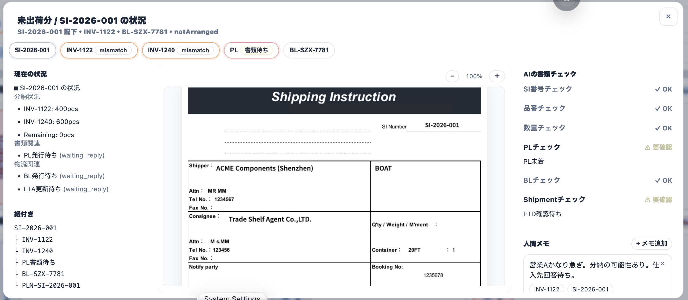
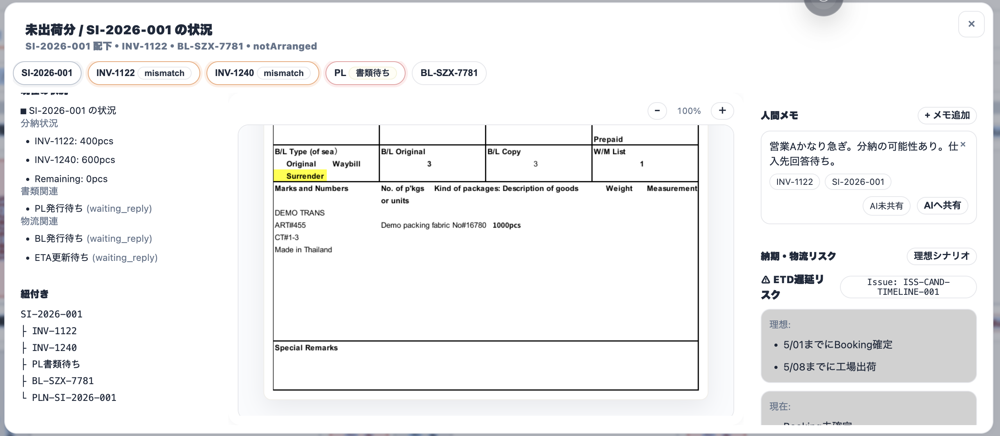
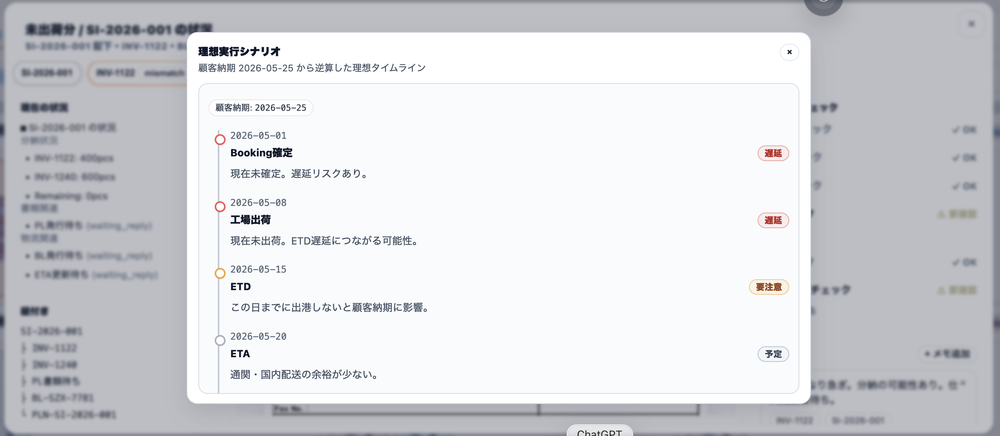
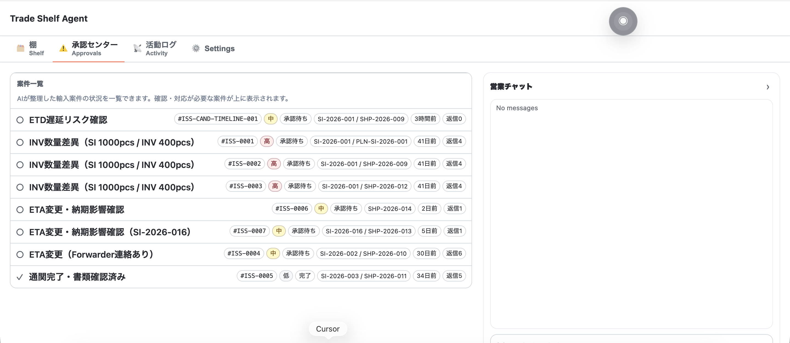
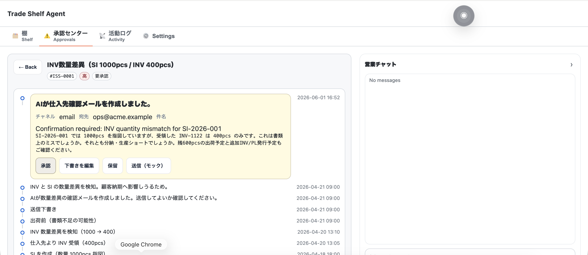
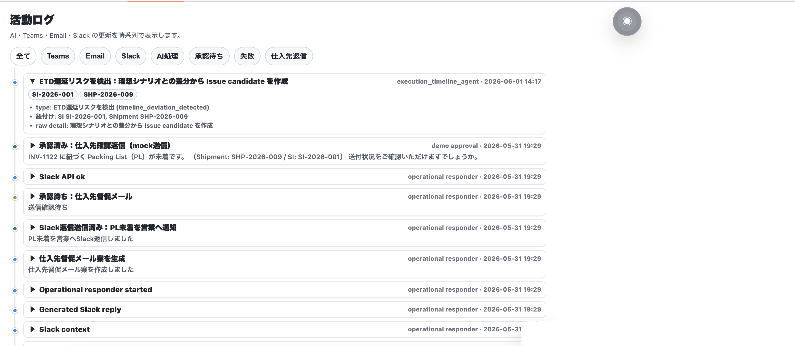
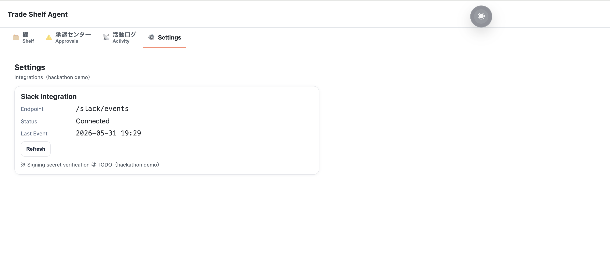

# 棚　shelf

 - 検索バー（各種書類番号からの検索が可能）
 - 本棚・本（本が棚を移動することで一目で状態がわかる）
 - 本のツールチップ（ホバーで状態がわかる・本をクリックでDocumentWorkspaceへ遷移）

Shipment / SI / INV などの「案件の状態」を、**本が棚を移動するUI**で表現する画面です。
営業やオペレーション担当は、まずここで「いま動いている案件」と「詰まっている状態（例：書類未着、通関、倉庫入荷待ち）」を一覧で把握します。

AI は裏側で、問い合わせやメモから抽出した番号（SI / SHP / INV）を `TradeCase` に寄せ、状態遷移の候補（例：出荷した/通関に進んだ、などの兆候）を検出して Activity に記録します。
ただし **棚の状態を確定させる操作は人間が行う**前提で、デモでは状態更新は承認（Approvals）や手動反映を挟む形にしています（自動で勝手に棚を動かしません）。
　
# Agent Toast

 - Agentの動きを常に監視・ドラッグで移動可能（xで閉じたら◎になって常駐）

「AIがいま何をしているか」を、画面上で常に追えるステータス表示です。
デモでは、ingest の実行や、分類・紐付け・下書き生成・承認待ちといった処理の節目が Activity と連動して可視化されます。
運用上は、
「AIが現在どの段階にいるか」
「不足情報待ちなのか」
「承認待ちなのか」
を即座に把握するためのUIです。

# Document Workspace

 - Documentごとのタブ（関連書類にすぐ遷移可能）
 - 現在の状況
 - 紐付き
 - 書類画像（AIが検知した差異や注意点のアノテーション ON OFF可能）
 - AIの書類チェック
 - 人間メモ
 - 納期・物流リスク(理想シナリオでAIが理想のスケジュールやリスクを提示)
 
特定の案件（TradeCase）にぶら下がる書類・番号・状況を、1つの作業場として確認する画面です。
棚から本をクリックすると遷移し、関連する書類（例：SI / INV / PL）を「同じ案件の文脈」で見直せます。

AI が裏でやっているのは、書類番号の正規化と紐付け（例：INV から Shipment/SI へ寄せる）、および状況の要約・注意点の抽出です。
一方で、書類の確定判断やメモの記録は人間が担います（AIの出力はあくまで下書き・候補として扱い、後段の承認や手動修正を残します）。

※「納期・物流リスク」は現状デモではプレースホルダー的な位置づけで、確定的な自動判断としては扱っていません。

# 承認センター　Approvals

 - 案件一覧
 - 案件詳細（AIのemail下書き承認・今までの会話履歴やステータスを確認可能）
 - 営業チャット(Slackの代理入口・営業からのメッセージ受付箱)

AI が生成した「外部送信に繋がるアクション」や「状態更新候補」を、**必ず人間が確認してから進める**ための画面です。
たとえば PL 未着のように、仕入先へ督促が必要そうなケースでは、AI がメール文面（下書き）を作り、承認待ちとしてここに積みます。

営業チャットは、Slack などの入口で受けた問い合わせをデモUI上でも追跡できるようにした窓口です。
重要なのは、Slack/Web で入口が違っても、AI側では `RawInput → 分類 → 紐付け → 下書き/承認` の処理として同じパイプラインで扱い、最終的な外部送信は承認フローを通す点です。

# 活動ログ　Activity

 - 活動ログ（AIの認識・活動・判断を時系列で表示）

AI の処理を「あとから説明できる形」で残すためのタイムラインです。
デモでは、依頼受信、情報不足の判定、確認質問、分類、番号の紐付け、下書き生成、承認待ち、といったイベントが時系列で表示されます。
運用上は「なぜこの判断になったのか」「どの番号に紐付いたのか」「どこで止まっているか」を追えることが目的で、Human-in-the-loop の根拠（承認待ちになった理由）もここで確認できます。

# 設定　Settings

 - Slack設定　（今後email設定なども導入予定）

デモで Slack 連携を動かすための設定項目です。
現状の実装では、Slack の受信（Events API）と、必要に応じた thread reply（Slack Web API）を行うための情報をここで扱います。
メールなど他チャネルの設定は、現時点ではデモの中心機能ではありません（このドキュメントでも、実装済みの範囲に留めます）。
