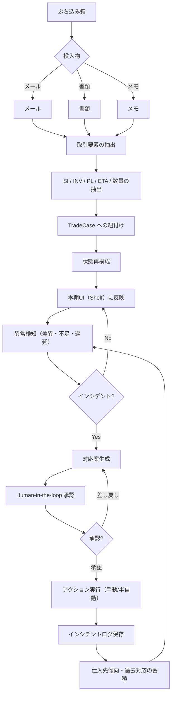

# Agentic Workflow（設計図）

Trade Shelf Agent は単なる管理画面ではなく、散在する業務情報を構造化し、異常検知し、人間承認を挟んで対応ログまで残す **Agentic Workflow** を目指します。

> NOTE: 現時点では workflow 可視化（設計図）を優先し、デモ用の入力（mock / demo data）を前提にしています。  
> 外部メール連携（Gmail / Outlook 等）、PDF/OCR、LLM API 呼び出しは本リポジトリでは **未実装** です。

## Workflow

## 補足

- 「アクション実行」は現時点では UI 上の操作・ステータス更新・メモ追記などを想定し、外部送信（メール自動送信等）は対象外です。
- 「蓄積」はナレッジ/ログとして将来の対応案生成・異常検知の精度向上に活用します。

